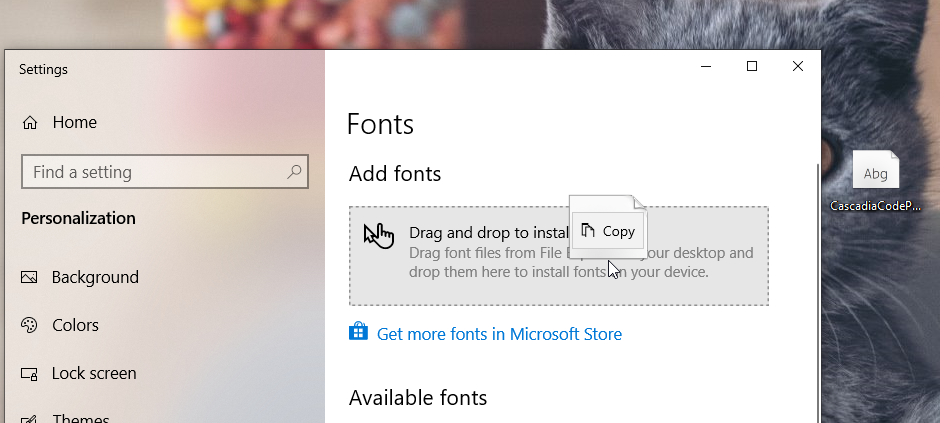
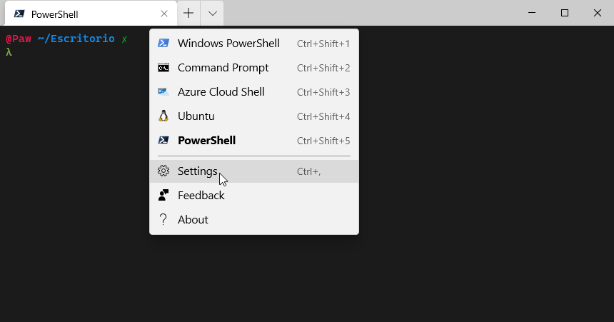
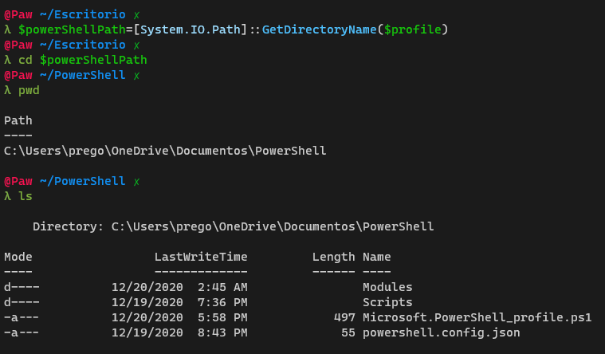
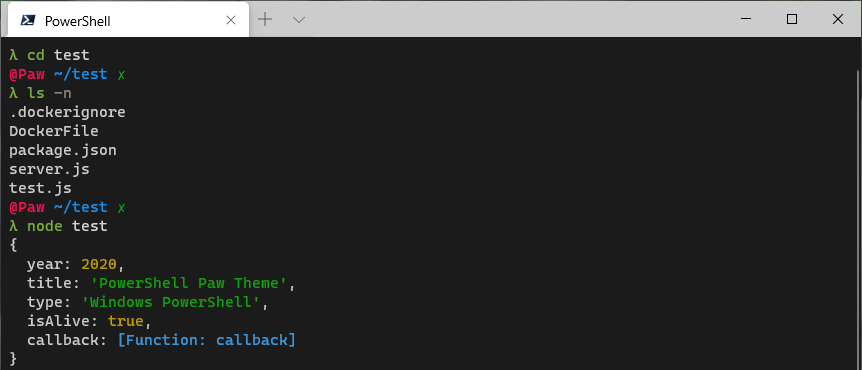

# Windows Terminal Powershell Core Paw Theme.

## 

This theme was created for the new [Windows Terminal](https://github.com/microsoft/terminal).

## Requirements

- [Windows Terminal](https://github.com/microsoft/terminal#installing-and-running-windows-terminal)
- [Oh-my-Posh V3](https://ohmyposh.dev/docs/installation)
- [Latest PowerShell Version](https://docs.microsoft.com/en-us/powershell/scripting/install/installing-powershell-core-on-windows?WT.mc_id=THOMASMAURER-blog-thmaure&view=powershell-7)
- [Cascadia Code font (optional)](https://github.com/microsoft/cascadia-code#installation)

## Steps.

### **1. Install requirements.**

Install the software listed above.
For Oh-my-Posh this is the [Official GitHub repo](https://github.com/JanDeDobbeleer/oh-my-posh)

### Install font Cascadia Code PL

From the [Microsoft Official GitHub repo](https://github.com/microsoft/cascadia-code/releases/download/v2009.22/CascadiaCode-2009.22.zip).

Unzip `CascadiaCodePL.ttf`, Open font settings then drag and drop the font.



---

### **2. Update Windows Terminal settings.**

Open Windows terminal and go to settings.



Update the file with this settings.

<sup>_file:_ settings.json</sup>

```json
{
  "defaultProfile": "{your-powershell-guid}",

  "profiles": {
    "defaults": {
      // You must have Cascadia code installed otherwise
      // Use another font of your choice.
      "fontFace": "Cascadia code PL",
      "fontSize": 12
    },
    "list": [
      // ... defaults
      {
        "guid": "{your-powershell-guid}",
        "hidden": false,
        "name": "PowerShell",
        // I use core PowershellCore
        "source": "Windows.Terminal.PowershellCore",
        "background": "#1b1b1b",
        "cursorColor": "#F2F2F2",
        "snapOnInput": true
      }
    ]
  }
}
```

---

### **2. Add Paw theme.**

First go to PowerShell dir.

<sup>PowerShell</sup>

```powershell
> $powerShellPath=[System.IO.Path]::GetDirectoryName($profile)
> cd $powerShellPath
```

It should look like this.


Now for simplicity open the folder

`> ii .`

Then navigate to themes under `/PowerShell/oh-my-posh/{3.XX}/themes`.
And copy [paw.omp.json](/paw.omp.json)


---

### **3. Update PowerShell settings.**

_Note: You must have installed [oh-my-posh](https://github.com/JanDeDobbeleer/oh-my-posh)._

Open Microsoft.PowerShell_profile.ps1

<sup>PowerShell</sup>

```powershell
> notepad $PROFILE
```

Now copy this settings.

<sup>_file:_ Microsoft.PowerShell_profile.ps1</sup>

```powershell
Import-Module posh-git
Import-Module oh-my-posh
Set-PoshPrompt paw

Set-PSReadLineOption -colors @{
  Command = "#7EAF3D"
  String = "#CE9178"
  Number = "#B5CEA8"
  Type =  "#9CDCFE"
  Keyword = "#4FC1FF"
  Operator = "#D4D4D4"
  Parameter = "#858585"
  Member = "#4FC1FF"
  ContinuationPrompt = "#F4C742"
  Emphasis = "#0EF600"
  Comment = "#6A9955"
  Default = "#D4D4D4"
  Selection = "`e[96;100m" #Color Bright Cyan, BG Color Bright Black
  InlinePrediction = "#4FC1FF"
}
```

---

### More demos:



